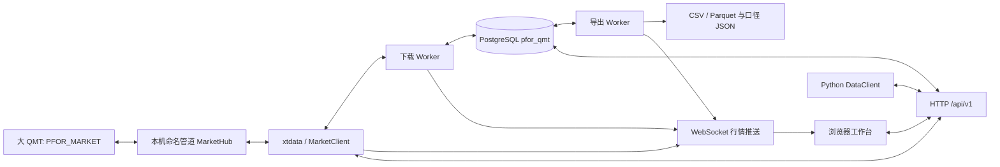

# 架构与二开入口

## Tushare 期货扩展

`accounts.py`负责多账号配置与脱敏，`tushare.py`负责公开HTTP协议、共享Token限流、受限分块、能力检测及字段转换，`identifiers.py`负责来源代码与合约身份。Tushare与QMT的目录、下载队列各自持有数据库锁，导出继续单独运行，QMT离线不阻塞Tushare。

两种来源经过相同normalize_bars校验、Store.write_chunk事务与覆盖检查点，进入同一bars表。instruments提供稳定身份；securities是统一目录及来源代码映射，以source/code唯一。bars以instrument_id/source/period/time唯一，trading_dates及contract_mappings也明确source。账号仅在数据集和任务记录中引用，Token不进入业务表。

旧QMT接口、默认来源及端点保持兼容。Tushare不模拟QMT缓存下载过程、不初始化交易或行情桥；端点响应的成功码不能代替实际数据校验与入库。测试只使用独立schema，真实Token由本地配置提供。

## 目录与职责

- `pfor_qmt/market_bridge.py`：Python3.6 行情白名单派发、QMT线程 pump、原生订阅和旧下载回退。
- `protocol.py`、`pipe_*`：固定上游传输实现。`client.py`、`hub.py` 叠加允许操作的边界。
- `xtdata.py`：兼容子集 SDK，直接经本机管道访问行情桥。
- `storage.py`、`migrations/`：schema限定、版本化迁移、精确数值、复合键去重、分页。
- `data.py`：代码、周期、日期验证，上海时间解析，不补零的数值标准化。
- `tasks.py`：各来源下载与目录队列、共享导出队列、数据库 advisory lock、断点、取消、重试和数据集调度。
- `reliability.py`、`maintenance.py`：执行与质量状态、错误分类、脱敏、显式维护范围和有限自动补数；`operations.js`展示运行与日志面板。
- `service.py`：应用接口与业务编排；`server.py`：标准库 HTTP、认证和独立 WebSocket。
- `sdk.py`：DataClient；`settings.py`：统一config.toml、环境覆盖、旧JSON迁移与密码哈希；QMT内嵌`config.py`只接收部署器生成的行情参数。
- `deploy.py`、`qmt_scripts/PFOR_MARKET.py`：独立模型准备、导入和启用。
- `web_dashboard/`：原生界面与本地 ECharts/Lucide；无 CDN 运行依赖。
- `tests/`：固定上游回归、模拟终端、真实本机管道、隔离PostgreSQL、浏览器测试。

## 状态与一致性

任务执行状态为queued、running、retrying、succeeded、partial、failed、blocked、cancelled，分块质量单独保存。取消设置持久化标记，终端已经接收的请求不撤销；下次处理前停止。每个来源下载与目录队列分别持有锁，导出队列另持共享锁，各自只恢复对应类型任务。重启沿检查点续跑，导出从头生成文件并重置行数。手动重试生成仅含未完成范围的关联任务，原任务和事件不改写；已由子任务修复的分块不重复下载。

每块最多一年日线或七天分钟线，来源接口按返回上限进一步细分。QMT下载后回读本地缓存，Tushare直接获取响应；均经标准化与业务校验后入库。行情、覆盖结果、分块质量、因子和检查点在同一数据库事务中提交。坏行情块不入库，独立块继续；来源级故障停止本次处理。价格、成交量和金额使用无固定小数位的NUMERIC；原输入已经损失的浮点精度无法恢复。

数据集调度使用对应来源交易日历，日历不可取得时仅使用已存真实交易日，不用周一至周五推断假期。默认QMT 17:00、Tushare 19:00，以唯一schedule_key去重，回读最近五个交易日并在启动后补建到期任务。目录、日历、映射、仓单和排名可从原始任务保存维护范围，目录每日执行，其他资料按对应日历执行；不自动扩大对象范围。下载和导出队列分开，历史请求或日历查询阻塞时不影响已入库数据导出。

导出分批读库，使用同一REPEATABLE READ只读事务。大文件不整体载入内存，HTTP分块传送。Parquet价格和数量列采用十进制文本以保留任意NUMERIC精度；口径JSON明确类型、时间、空值、来源与范围。

## 推荐二开顺序

先运行离线测试，再阅读 `service.py -> tasks.py -> storage.py` 理解业务链路。新增行情能力先调整 `policy.py`、桥端与SDK，补模拟输入和真实终端能力验证；增加字段先写迁移和数据口径，再修改API、导出和页面。不要从上游交易继承类重新引入功能。

普通Python四空格，UTF-8；终端入口使用GBK声明并保持ASCII正文，部署器通过转义字面量注入路径。前端两空格；项目当前没有单独lint/format工具，不进行全库格式化。测试命名`test_*.py`。

提交使用简短祈使句，沿用上游常见 `Add ...`、`Fix ...`、`Update ...` 风格，当前历史未强制Conventional Commits。PR说明问题、改动范围、验证结果和残留风险；接口变化更新兼容矩阵，页面变化附桌面/移动截图，涉及既有问题时关联issue。
