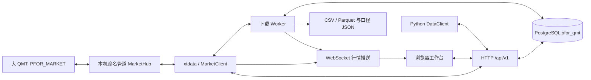

# 架构与二开入口

## 目录与职责

- `pfor_qmt/market_bridge.py`：Python3.6 行情白名单派发、QMT线程 pump、原生订阅和旧下载回退。
- `protocol.py`、`pipe_*`：固定上游传输实现。`client.py`、`hub.py` 叠加允许操作的边界。
- `xtdata.py`：兼容子集 SDK，直接经本机管道访问行情桥。
- `storage.py`、`migrations/`：schema限定、版本化迁移、精确数值、复合键去重、分页。
- `data.py`：代码、周期、日期验证，上海时间解析，不补零的数值标准化。
- `tasks.py`：单工作线程、数据库 advisory lock、断点、取消、重试、17:00调度和导出。
- `service.py`：应用接口与业务编排；`server.py`：标准库 HTTP、认证和独立 WebSocket。
- `sdk.py`：DataClient；`settings.py`：本地配置与密码哈希。
- `deploy.py`、`qmt_scripts/PFOR_MARKET.py`：独立模型准备、导入和启用。
- `web_dashboard/`：原生界面与本地 ECharts/Lucide；无 CDN 运行依赖。
- `tests/`：固定上游回归、模拟终端、真实本机管道、隔离PostgreSQL、浏览器测试。

## 状态与一致性

任务：`queued -> running -> completed/partial/failed/cancelled`。取消设置持久化标记，终端已经接收的请求不撤销；下次处理前停止。进程恢复时将未结束的running任务重新排队，沿检查点续跑。partial重试从头重新校验，upsert消除重复。

每块最多一年日线或七天分钟线。下载请求结束后读回本地行情，空表等待有限次数并标记未确认。行情、覆盖结果、因子和检查点在同一数据库事务中提交。价格、成交量和金额使用无固定小数位的NUMERIC；原输入已经损失的浮点精度无法恢复。

调度使用QMT交易日历，日历不可取得时使用已存真实交易日，不用周一至周五推断假期。每天17:00为每个启用的数据集创建一个唯一schedule_key任务，回读最近五个交易日，启动后补建尚未创建的到期任务。

导出分批读库，使用同一REPEATABLE READ只读事务。大文件不整体载入内存，HTTP分块传送。Parquet价格和数量列采用十进制文本以保留任意NUMERIC精度；口径JSON明确类型、时间、空值、来源与范围。

## 推荐二开顺序

先运行离线测试，再阅读 `service.py -> tasks.py -> storage.py` 理解业务链路。新增行情能力先调整 `policy.py`、桥端与SDK，补模拟输入和真实终端能力验证；增加字段先写迁移和数据口径，再修改API、导出和页面。不要从上游交易继承类重新引入功能。

普通Python四空格，UTF-8；终端入口使用GBK声明并保持ASCII正文，部署器通过转义字面量注入路径。前端两空格；项目当前没有单独lint/format工具，不进行全库格式化。测试命名`test_*.py`。

提交使用简短祈使句，沿用上游常见 `Add ...`、`Fix ...`、`Update ...` 风格，当前历史未强制Conventional Commits。PR说明问题、改动范围、验证结果和残留风险；接口变化更新兼容矩阵，页面变化附桌面/移动截图，涉及既有问题时关联issue。
