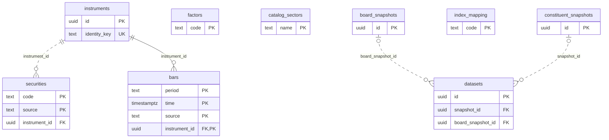
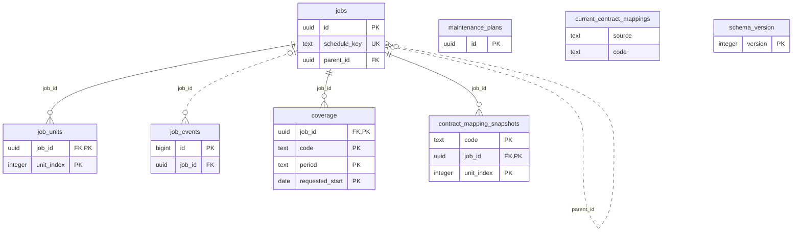
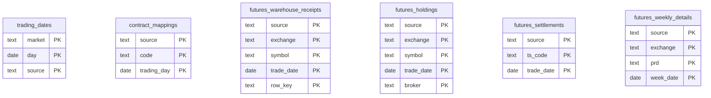
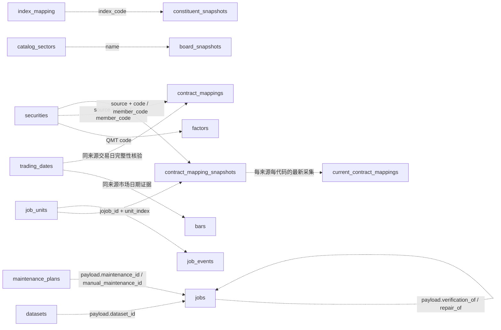

# 数据库结构、ER图与字段字典

适用迁移版本：13。覆盖 22 张表、1 个视图、229 个字段。

本文由 `tools/generate_schema_docs.py` 读取PostgreSQL系统目录生成，不读取业务行、账号Token或连接密码。SQL迁移中的COMMENT是说明来源；更改结构或口径后应更新迁移并重新生成。

```powershell
.venv\Scripts\python.exe -X utf8 -m pfor_qmt.cli migrate
.venv\Scripts\python.exe -X utf8 tools/generate_schema_docs.py
.venv\Scripts\python.exe -X utf8 tools/generate_schema_docs.py --check
```

## 阅读约定

- 物理ER图仅绘制真实外键，实体内列出主键、外键和单列唯一键；复合键按各组成字段标PK。全部字段见下方字典。
- `||`表示恰好一个，`o|`表示零或一个，`o{`表示零或多个；非标识关系使用虚线，仍是实际外键。视图没有物理主键和外键。
- JSON数组、代码匹配和任务payload引用是业务逻辑关系，不具备数据库外键约束，单独在逻辑关系图说明。
- NULL保留“未提供/未确认”，不视为零；金额、成交量与价格口径按来源及转换版本解释。
- 日历完整性、数据新鲜度和任务执行成功是不同概念；当前映射快照不能代替历史逐日映射。

## 物理ER图

### 目录、身份与行情



### 任务、维护与当前映射



### 交易日历与期货资料



## 逻辑关系（非外键）

以下仅表示代码中的引用或查询关系，不表示数据库强制约束，也不声明完整的关系基数。



成员数组、资料品种与上游原始字段继续保存在JSON或来源标识中；未额外建账号表，Token只保存在本地配置。仓单、排名、结算、周报没有到证券目录的物理外键。

## 表与字段字典

### 目录、身份与行情

#### instruments

保存可跨数据源复用的证券或合约身份。

| 字段 | PostgreSQL类型 | 可空 | 默认值 | 注释 |
| --- | --- | --- | --- | --- |
| id | uuid | 否 | gen_random_uuid() | 证券或合约的稳定身份编号。 |
| identity_key | text | 否 | 无 | 身份唯一键。 |

- `instruments_identity_key_key`：`UNIQUE (identity_key)`
- `instruments_pkey`：`PRIMARY KEY (id)`

<details><summary>索引定义</summary>

```sql
CREATE UNIQUE INDEX instruments_identity_key_key ON pfor_qmt.instruments USING btree (identity_key);
CREATE UNIQUE INDEX instruments_pkey ON pfor_qmt.instruments USING btree (id);
```

</details>

#### securities

保存证券目录和数据源代码。

| 字段 | PostgreSQL类型 | 可空 | 默认值 | 注释 |
| --- | --- | --- | --- | --- |
| code | text | 否 | 无 | 数据源中的证券或合约代码。 |
| name | text | 否 | 无 | 证券或合约名称。 |
| kind | text | 否 | 无 | 资产类别，如股票、指数、期货、期权、基金或债券。 |
| details | jsonb | 否 | '{}'::jsonb | 数据源返回的原始资料。 |
| source | text | 否 | 'qmt'::text | 数据来源，如qmt或tushare。 |
| updated_at | timestamp with time zone | 否 | now() | 目录记录更新时间。 |
| subtype | text | 否 | ''::text | 细分类别，如月份合约、连续合约或ETF。 |
| market | text | 否 | ''::text | 市场或交易所代码。 |
| metadata | jsonb | 否 | '{}'::jsonb | 证券的补充资料，如品种、上市日和到期日。 |
| instrument_id | uuid | 否 | 无 | 对应的稳定身份编号。 |

- `securities_instrument_id_fkey`：`FOREIGN KEY (instrument_id) REFERENCES instruments(id)`
- `securities_kind_check`：`CHECK ((kind = ANY (ARRAY['stock'::text, 'index'::text, 'future'::text, 'option'::text, 'fund'::text, 'bond'::text])))`
- `securities_pkey`：`PRIMARY KEY (source, code)`

<details><summary>索引定义</summary>

```sql
CREATE INDEX securities_instrument_idx ON pfor_qmt.securities USING btree (instrument_id, source);
CREATE INDEX securities_kind_market_idx ON pfor_qmt.securities USING btree (kind, market, code);
CREATE UNIQUE INDEX securities_pkey ON pfor_qmt.securities USING btree (source, code);
```

</details>

#### bars

保存不复权历史K线。

| 字段 | PostgreSQL类型 | 可空 | 默认值 | 注释 |
| --- | --- | --- | --- | --- |
| code | text | 否 | 无 | 证券或合约代码。 |
| period | text | 否 | 无 | K线周期，如1d、1m、5m、1w或1mo。 |
| time | timestamp with time zone | 否 | 无 | K线时间，按上海时间解释。 |
| open | numeric | 是 | 无 | 开盘价。 |
| high | numeric | 是 | 无 | 最高价。 |
| low | numeric | 是 | 无 | 最低价。 |
| close | numeric | 是 | 无 | 收盘价。 |
| volume | numeric | 是 | 无 | 成交量；期货通常以手为单位。 |
| amount | numeric | 是 | 无 | 成交额；统一按元保存时需结合来源说明。 |
| source | text | 否 | 'qmt'::text | 行情来源。 |
| updated_at | timestamp with time zone | 否 | now() | 行情记录入库或更新的时间。 |
| open_interest | numeric | 是 | 无 | 持仓量；期货通常以手为单位。 |
| settlement | numeric | 是 | 无 | 结算价。 |
| previous_settlement | numeric | 是 | 无 | 前一交易日结算价。 |
| trading_day | date | 是 | 无 | 行情所属交易日。 |
| instrument_id | uuid | 否 | 无 | 对应的稳定身份编号。 |
| normalization_version | text | 否 | 'qmt-raw-v1'::text | 行情标准化规则版本。 |
| as_of_date | date | 是 | 无 | 周线或月线的统计截止日。 |
| source_fields | jsonb | 否 | '{}'::jsonb | 来源返回的原始字段和转换信息。 |

- `bars_instrument_id_fkey`：`FOREIGN KEY (instrument_id) REFERENCES instruments(id)`
- `bars_period_check`：`CHECK (((period = ANY (ARRAY['1d'::text, '1m'::text, '5m'::text])) OR ((source = 'tushare'::text) AND (period = ANY (ARRAY['1w'::text, '1mo'::text, '15m'::text, '30m'::text, '60m'::text])))))`
- `bars_pkey`：`PRIMARY KEY (instrument_id, source, period, "time")`

<details><summary>索引定义</summary>

```sql
CREATE UNIQUE INDEX bars_pkey ON pfor_qmt.bars USING btree (instrument_id, source, period, "time");
CREATE INDEX bars_source_code_time_idx ON pfor_qmt.bars USING btree (source, code, period, "time");
```

</details>

#### factors

保存QMT返回的复权因子。

| 字段 | PostgreSQL类型 | 可空 | 默认值 | 注释 |
| --- | --- | --- | --- | --- |
| code | text | 否 | 无 | 证券代码。 |
| raw | jsonb | 否 | 无 | 复权因子原始资料。 |
| observed_at | timestamp with time zone | 否 | now() | 复权因子采集时间。 |

- `factors_pkey`：`PRIMARY KEY (code)`

<details><summary>索引定义</summary>

```sql
CREATE UNIQUE INDEX factors_pkey ON pfor_qmt.factors USING btree (code);
```

</details>

#### catalog_sectors

保存QMT行业和概念板块目录。

| 字段 | PostgreSQL类型 | 可空 | 默认值 | 注释 |
| --- | --- | --- | --- | --- |
| name | text | 否 | 无 | 板块名称。 |
| observed_at | timestamp with time zone | 否 | now() | 板块目录更新时间。 |
| category | text | 否 | 'other'::text | 板块类别，如行业或概念。 |
| path | jsonb | 否 | '[]'::jsonb | 板块在分类树中的路径。 |

- `catalog_sectors_pkey`：`PRIMARY KEY (name)`

<details><summary>索引定义</summary>

```sql
CREATE UNIQUE INDEX catalog_sectors_pkey ON pfor_qmt.catalog_sectors USING btree (name);
```

</details>

#### board_snapshots

保存行业或概念板块的成员快照。

| 字段 | PostgreSQL类型 | 可空 | 默认值 | 注释 |
| --- | --- | --- | --- | --- |
| id | uuid | 否 | 无 | 板块快照编号。 |
| name | text | 否 | 无 | 板块名称。 |
| category | text | 否 | 无 | 板块类别。 |
| members | jsonb | 否 | 无 | 板块成员证券代码列表。 |
| observed_at | timestamp with time zone | 否 | now() | 成员采集时间。 |

- `board_snapshots_pkey`：`PRIMARY KEY (id)`

<details><summary>索引定义</summary>

```sql
CREATE INDEX board_snapshots_latest_idx ON pfor_qmt.board_snapshots USING btree (name, observed_at DESC);
CREATE UNIQUE INDEX board_snapshots_pkey ON pfor_qmt.board_snapshots USING btree (id);
```

</details>

#### index_mapping

保存指数代码与QMT板块的对应关系。

| 字段 | PostgreSQL类型 | 可空 | 默认值 | 注释 |
| --- | --- | --- | --- | --- |
| code | text | 否 | 无 | 指数代码。 |
| sector | text | 否 | 无 | QMT板块名称。 |
| name | text | 否 | 无 | 指数显示名称。 |
| updated_at | timestamp with time zone | 否 | now() | 映射更新时间。 |

- `index_mapping_pkey`：`PRIMARY KEY (code)`

<details><summary>索引定义</summary>

```sql
CREATE UNIQUE INDEX index_mapping_pkey ON pfor_qmt.index_mapping USING btree (code);
```

</details>

#### constituent_snapshots

保存指数当前成分快照。

| 字段 | PostgreSQL类型 | 可空 | 默认值 | 注释 |
| --- | --- | --- | --- | --- |
| id | uuid | 否 | 无 | 成分快照编号。 |
| index_code | text | 否 | 无 | 指数代码。 |
| observed_at | timestamp with time zone | 否 | now() | 成分采集时间。 |
| members | jsonb | 否 | 无 | 成分证券代码列表。 |

- `constituent_snapshots_pkey`：`PRIMARY KEY (id)`

<details><summary>索引定义</summary>

```sql
CREATE UNIQUE INDEX constituent_snapshots_pkey ON pfor_qmt.constituent_snapshots USING btree (id);
```

</details>

#### datasets

保存固定的证券、周期和采集设置。

| 字段 | PostgreSQL类型 | 可空 | 默认值 | 注释 |
| --- | --- | --- | --- | --- |
| id | uuid | 否 | 无 | 数据集编号。 |
| name | text | 否 | 无 | 数据集名称。 |
| members | jsonb | 否 | 无 | 数据集成员代码列表。 |
| periods | jsonb | 否 | 无 | 数据集选择的K线周期。 |
| index_code | text | 是 | 无 | 数据集使用的指数代码。 |
| snapshot_id | uuid | 是 | 无 | 使用的指数成分快照编号。 |
| scheduled | boolean | 否 | false | 是否启用自动更新。 |
| schedule_from | date | 否 | CURRENT_DATE | 自动更新的起始日期。 |
| created_at | timestamp with time zone | 否 | now() | 数据集创建时间。 |
| board_name | text | 是 | 无 | 数据集使用的板块名称。 |
| board_snapshot_id | uuid | 是 | 无 | 使用的板块快照编号。 |
| source | text | 否 | 'qmt'::text | 数据来源。 |
| account_id | text | 是 | 无 | Tushare账号编号。 |
| endpoint | text | 是 | 无 | 任务使用的接口地址。 |
| schedule_time | time without time zone | 否 | '17:00:00'::time without time zone | 自动更新时间。 |
| revision | integer | 否 | 1 | 配置版本号。 |
| deleted_at | timestamp with time zone | 是 | 无 | 进入回收站的时间。 |

- `datasets_board_snapshot_id_fkey`：`FOREIGN KEY (board_snapshot_id) REFERENCES board_snapshots(id)`
- `datasets_pkey`：`PRIMARY KEY (id)`
- `datasets_snapshot_id_fkey`：`FOREIGN KEY (snapshot_id) REFERENCES constituent_snapshots(id)`
- `datasets_source_check`：`CHECK ((source = ANY (ARRAY['qmt'::text, 'tushare'::text])))`
- `deleted_dataset_disabled`：`CHECK (((deleted_at IS NULL) OR (NOT scheduled)))`

<details><summary>索引定义</summary>

```sql
CREATE UNIQUE INDEX datasets_pkey ON pfor_qmt.datasets USING btree (id);
```

</details>

### 任务、维护与当前映射

#### jobs

保存目录同步、数据采集、导出和核验任务。

| 字段 | PostgreSQL类型 | 可空 | 默认值 | 注释 |
| --- | --- | --- | --- | --- |
| id | uuid | 否 | 无 | 任务编号。 |
| kind | text | 否 | 无 | 任务类型。 |
| state | text | 否 | 'queued'::text | 任务执行状态。 |
| payload | jsonb | 否 | 无 | 任务请求参数。 |
| checkpoint | integer | 否 | 0 | 任务恢复位置。 |
| attempts | integer | 否 | 0 | 当前重试次数。 |
| cancel_requested | boolean | 否 | false | 是否请求取消任务。 |
| result | jsonb | 否 | '{}'::jsonb | 任务结果和统计信息。 |
| error | text | 是 | 无 | 最近一次错误说明。 |
| schedule_key | text | 是 | 无 | 调度任务去重标识。 |
| created_at | timestamp with time zone | 否 | now() | 任务创建时间。 |
| updated_at | timestamp with time zone | 否 | now() | 任务更新时间。 |
| parent_id | uuid | 是 | 无 | 关联的父任务编号。 |
| error_code | text | 是 | 无 | 错误分类代码。 |
| action | text | 是 | 无 | 建议采取的处理动作。 |
| run_number | integer | 否 | 0 | 任务执行轮次。 |
| deleted_at | timestamp with time zone | 是 | 无 | 进入回收站的时间。 |

- `deleted_job_inactive`：`CHECK (((deleted_at IS NULL) OR (state <> ALL (ARRAY['queued'::text, 'running'::text, 'retrying'::text]))))`
- `jobs_kind_check`：`CHECK ((kind = ANY (ARRAY['catalog'::text, 'download'::text, 'export'::text, 'verify'::text])))`
- `jobs_parent_id_fkey`：`FOREIGN KEY (parent_id) REFERENCES jobs(id)`
- `jobs_pkey`：`PRIMARY KEY (id)`
- `jobs_schedule_key_key`：`UNIQUE (schedule_key)`

<details><summary>索引定义</summary>

```sql
CREATE INDEX jobs_console_source_created ON pfor_qmt.jobs USING btree (COALESCE((payload ->> 'source'::text), 'qmt'::text), created_at DESC, id);
CREATE INDEX jobs_parent_idx ON pfor_qmt.jobs USING btree (parent_id);
CREATE UNIQUE INDEX jobs_pkey ON pfor_qmt.jobs USING btree (id);
CREATE INDEX jobs_provider_queue_idx ON pfor_qmt.jobs USING btree (kind, state, COALESCE((payload ->> 'source'::text), 'qmt'::text), created_at);
CREATE INDEX jobs_queue_idx ON pfor_qmt.jobs USING btree (kind, state, created_at);
CREATE UNIQUE INDEX jobs_schedule_key_key ON pfor_qmt.jobs USING btree (schedule_key);
```

</details>

#### job_units

保存任务每个分块的执行和质量结果。

| 字段 | PostgreSQL类型 | 可空 | 默认值 | 注释 |
| --- | --- | --- | --- | --- |
| job_id | uuid | 否 | 无 | 任务编号。 |
| unit_index | integer | 否 | 无 | 分块序号。 |
| request | jsonb | 否 | 无 | 分块请求参数。 |
| state | text | 否 | 无 | 分块执行状态。 |
| quality_state | text | 否 | 无 | 分块数据质量状态。 |
| row_count | integer | 否 | 0 | 分块记录数。 |
| issues | jsonb | 否 | '[]'::jsonb | 分块发现的问题。 |
| error_code | text | 是 | 无 | 分块错误分类代码。 |
| retryable | boolean | 否 | false | 是否可以重试。 |
| stats | jsonb | 否 | '{}'::jsonb | 分块读写统计。 |
| updated_at | timestamp with time zone | 否 | now() | 分块结果更新时间。 |

- `job_units_job_id_fkey`：`FOREIGN KEY (job_id) REFERENCES jobs(id)`
- `job_units_pkey`：`PRIMARY KEY (job_id, unit_index)`

<details><summary>索引定义</summary>

```sql
CREATE UNIQUE INDEX job_units_pkey ON pfor_qmt.job_units USING btree (job_id, unit_index);
```

</details>

#### job_events

保存任务和服务运行事件。

| 字段 | PostgreSQL类型 | 可空 | 默认值 | 注释 |
| --- | --- | --- | --- | --- |
| id | bigint | 否 | nextval('job_events_id_seq'::regclass) | 事件编号。 |
| job_id | uuid | 是 | 无 | 关联任务编号。 |
| run_number | integer | 否 | 0 | 事件所属的执行轮次。 |
| unit_index | integer | 是 | 无 | 关联的分块序号。 |
| level | text | 否 | 无 | 日志级别。 |
| code | text | 否 | 无 | 事件代码。 |
| message | text | 否 | 无 | 事件说明。 |
| context | jsonb | 否 | '{}'::jsonb | 事件上下文和统计信息。 |
| sample | jsonb | 是 | 无 | 脱敏异常样本。 |
| created_at | timestamp with time zone | 否 | now() | 事件发生时间。 |

- `job_events_job_id_fkey`：`FOREIGN KEY (job_id) REFERENCES jobs(id)`
- `job_events_pkey`：`PRIMARY KEY (id)`

<details><summary>索引定义</summary>

```sql
CREATE INDEX job_events_job_idx ON pfor_qmt.job_events USING btree (job_id, id);
CREATE UNIQUE INDEX job_events_pkey ON pfor_qmt.job_events USING btree (id);
CREATE INDEX job_events_time_idx ON pfor_qmt.job_events USING btree (created_at);
```

</details>

#### coverage

保存任务请求范围、实际范围和缺口。

| 字段 | PostgreSQL类型 | 可空 | 默认值 | 注释 |
| --- | --- | --- | --- | --- |
| job_id | uuid | 否 | 无 | 任务编号。 |
| code | text | 否 | 无 | 证券、合约或资料对象代码。 |
| period | text | 否 | 无 | K线周期或资料类型。 |
| requested_start | date | 否 | 无 | 请求开始日期。 |
| requested_end | date | 否 | 无 | 请求结束日期。 |
| actual_start | timestamp with time zone | 是 | 无 | 实际数据开始时间。 |
| actual_end | timestamp with time zone | 是 | 无 | 实际数据结束时间。 |
| row_count | integer | 否 | 无 | 读取或保存的记录数。 |
| gaps | jsonb | 否 | '[]'::jsonb | 未完成范围和质量问题。 |

- `coverage_job_id_fkey`：`FOREIGN KEY (job_id) REFERENCES jobs(id)`
- `coverage_pkey`：`PRIMARY KEY (job_id, code, period, requested_start)`

<details><summary>索引定义</summary>

```sql
CREATE UNIQUE INDEX coverage_pkey ON pfor_qmt.coverage USING btree (job_id, code, period, requested_start);
```

</details>

#### maintenance_plans

保存目录和资料的自动维护计划。

| 字段 | PostgreSQL类型 | 可空 | 默认值 | 注释 |
| --- | --- | --- | --- | --- |
| id | uuid | 否 | 无 | 维护计划编号。 |
| name | text | 否 | 无 | 维护计划名称。 |
| source | text | 否 | 无 | 数据来源。 |
| kind | text | 否 | 无 | 维护内容类型。 |
| payload | jsonb | 否 | 无 | 维护范围和参数。 |
| enabled | boolean | 否 | true | 是否启用计划。 |
| schedule_time | time without time zone | 否 | 无 | 每日执行时间。 |
| lookback_days | integer | 否 | 5 | 每次回看的天数。 |
| last_date | date | 是 | 无 | 最近一次入队的截止日期。 |
| last_error | text | 是 | 无 | 最近一次调度错误。 |
| updated_at | timestamp with time zone | 否 | now() | 计划更新时间。 |
| revision | integer | 否 | 1 | 配置版本号。 |
| deleted_at | timestamp with time zone | 是 | 无 | 进入回收站的时间。 |

- `deleted_plan_disabled`：`CHECK (((deleted_at IS NULL) OR (NOT enabled)))`
- `maintenance_plans_kind_check`：`CHECK ((kind = ANY (ARRAY['catalog'::text, 'download'::text])))`
- `maintenance_plans_lookback_days_check`：`CHECK (((lookback_days >= 1) AND (lookback_days <= 365)))`
- `maintenance_plans_pkey`：`PRIMARY KEY (id)`

<details><summary>索引定义</summary>

```sql
CREATE UNIQUE INDEX maintenance_plans_pkey ON pfor_qmt.maintenance_plans USING btree (id);
```

</details>

#### contract_mapping_snapshots

保存当前主力或连续合约映射快照。

| 字段 | PostgreSQL类型 | 可空 | 默认值 | 注释 |
| --- | --- | --- | --- | --- |
| source | text | 否 | 无 | 映射来源。 |
| code | text | 否 | 无 | 主力或连续合约代码。 |
| member_code | text | 否 | 无 | 当前对应的月份合约代码。 |
| observed_at | timestamp with time zone | 否 | 无 | 快照采集时间。 |
| trading_day | date | 是 | 无 | 终端返回的交易日。 |
| job_id | uuid | 否 | 无 | 生成快照的任务编号。 |
| unit_index | integer | 否 | 无 | 任务内的分块序号。 |
| source_fields | jsonb | 否 | 无 | 来源返回的原始映射字段。 |

- `contract_mapping_snapshots_job_id_fkey`：`FOREIGN KEY (job_id) REFERENCES jobs(id)`
- `contract_mapping_snapshots_pkey`：`PRIMARY KEY (job_id, unit_index, code)`

<details><summary>索引定义</summary>

```sql
CREATE UNIQUE INDEX contract_mapping_snapshots_pkey ON pfor_qmt.contract_mapping_snapshots USING btree (job_id, unit_index, code);
CREATE INDEX mapping_snapshots_latest_idx ON pfor_qmt.contract_mapping_snapshots USING btree (source, code, observed_at DESC);
```

</details>

#### current_contract_mappings（视图）

展示每个主力或连续代码最近保存的映射。

| 字段 | PostgreSQL类型 | 可空 | 默认值 | 注释 |
| --- | --- | --- | --- | --- |
| source | text | 视图派生 | 无 | 映射来源。 |
| code | text | 视图派生 | 无 | 主力或连续合约代码。 |
| member_code | text | 视图派生 | 无 | 当前对应的月份合约代码。 |
| observed_at | timestamp with time zone | 视图派生 | 无 | 最近快照采集时间。 |
| trading_day | date | 视图派生 | 无 | 快照中的交易日。 |
| job_id | uuid | 视图派生 | 无 | 生成快照的任务编号。 |
| unit_index | integer | 视图派生 | 无 | 任务内的分块序号。 |
| source_fields | jsonb | 视图派生 | 无 | 来源返回的原始映射字段。 |
| row_version | xid | 视图派生 | 无 | 数据库行版本标识。 |

```sql
 SELECT DISTINCT ON (source, code) source,
    code,
    member_code,
    observed_at,
    trading_day,
    job_id,
    unit_index,
    source_fields,
    xmin AS row_version
   FROM contract_mapping_snapshots
  ORDER BY source, code, observed_at DESC, job_id DESC;
```

#### schema_version

记录数据库已执行的迁移版本。

| 字段 | PostgreSQL类型 | 可空 | 默认值 | 注释 |
| --- | --- | --- | --- | --- |
| version | integer | 否 | 无 | 迁移版本号。 |
| applied_at | timestamp with time zone | 否 | now() | 迁移完成时间。 |

- `schema_version_pkey`：`PRIMARY KEY (version)`

<details><summary>索引定义</summary>

```sql
CREATE UNIQUE INDEX schema_version_pkey ON pfor_qmt.schema_version USING btree (version);
```

</details>

### 交易日历与期货资料

#### trading_dates

保存数据源提供的交易日历记录。

| 字段 | PostgreSQL类型 | 可空 | 默认值 | 注释 |
| --- | --- | --- | --- | --- |
| market | text | 否 | 无 | 市场或交易所代码。 |
| day | date | 否 | 无 | 日历日期。 |
| source | text | 否 | 'qmt'::text | 日历来源。 |
| is_open | boolean | 否 | true | 当天是否开市。 |
| pretrade_date | date | 是 | 无 | 上一个交易日。 |
| evidence | text | 否 | 'legacy'::text | 日历记录的依据类型。 |
| observed_at | timestamp with time zone | 是 | 无 | 日历记录采集时间。 |
| source_fields | jsonb | 是 | 无 | 来源返回的原始日历字段。 |

- `trading_dates_pkey`：`PRIMARY KEY (source, market, day)`

<details><summary>索引定义</summary>

```sql
CREATE UNIQUE INDEX trading_dates_pkey ON pfor_qmt.trading_dates USING btree (source, market, day);
```

</details>

#### contract_mappings

保存历史主力或连续合约到月份合约的映射。

| 字段 | PostgreSQL类型 | 可空 | 默认值 | 注释 |
| --- | --- | --- | --- | --- |
| source | text | 否 | 无 | 映射来源。 |
| code | text | 否 | 无 | 主力或连续合约代码。 |
| trading_day | date | 否 | 无 | 映射所属交易日。 |
| member_code | text | 否 | 无 | 当天对应的月份合约代码。 |
| updated_at | timestamp with time zone | 否 | now() | 映射记录更新时间。 |
| source_fields | jsonb | 是 | 无 | 来源返回的原始映射字段。 |

- `contract_mappings_pkey`：`PRIMARY KEY (source, code, trading_day)`

<details><summary>索引定义</summary>

```sql
CREATE UNIQUE INDEX contract_mappings_pkey ON pfor_qmt.contract_mappings USING btree (source, code, trading_day);
```

</details>

#### futures_warehouse_receipts

保存期货仓单日报明细。

| 字段 | PostgreSQL类型 | 可空 | 默认值 | 注释 |
| --- | --- | --- | --- | --- |
| source | text | 否 | 无 | 资料来源。 |
| exchange | text | 否 | 无 | 交易所代码。 |
| symbol | text | 否 | 无 | 期货品种代码。 |
| trade_date | date | 否 | 无 | 仓单日期。 |
| row_key | text | 否 | 无 | 仓单明细唯一标识。 |
| fut_name | text | 是 | 无 | 期货品种名称。 |
| warehouse | text | 是 | 无 | 仓库或厂库名称。 |
| wh_id | text | 是 | 无 | 仓库编号。 |
| pre_vol | numeric | 是 | 无 | 前日仓单数量。 |
| vol | numeric | 是 | 无 | 当日仓单数量。 |
| vol_chg | numeric | 是 | 无 | 仓单数量变化。 |
| area | text | 是 | 无 | 地区。 |
| year | text | 是 | 无 | 年度标记。 |
| grade | text | 是 | 无 | 等级。 |
| brand | text | 是 | 无 | 品牌。 |
| place | text | 是 | 无 | 产地。 |
| pd | numeric | 是 | 无 | 升贴水。 |
| is_ct | text | 是 | 无 | 是否为折算仓单。 |
| unit | text | 是 | 无 | 数量单位。 |
| updated_at | timestamp with time zone | 否 | now() | 记录更新时间。 |

- `futures_warehouse_receipts_pkey`：`PRIMARY KEY (source, exchange, symbol, trade_date, row_key)`

<details><summary>索引定义</summary>

```sql
CREATE UNIQUE INDEX futures_warehouse_receipts_pkey ON pfor_qmt.futures_warehouse_receipts USING btree (source, exchange, symbol, trade_date, row_key);
```

</details>

#### futures_holdings

保存期货每日成交和持仓排名。

| 字段 | PostgreSQL类型 | 可空 | 默认值 | 注释 |
| --- | --- | --- | --- | --- |
| source | text | 否 | 无 | 资料来源。 |
| exchange | text | 否 | 无 | 交易所代码。 |
| symbol | text | 否 | 无 | 品种或合约代码。 |
| trade_date | date | 否 | 无 | 资料交易日期。 |
| broker | text | 否 | 无 | 期货公司或会员名称。 |
| vol | numeric | 是 | 无 | 成交量，单位手。 |
| vol_chg | numeric | 是 | 无 | 成交量变化，单位手。 |
| long_hld | numeric | 是 | 无 | 多头持仓量，单位手。 |
| long_chg | numeric | 是 | 无 | 多头持仓变化，单位手。 |
| short_hld | numeric | 是 | 无 | 空头持仓量，单位手。 |
| short_chg | numeric | 是 | 无 | 空头持仓变化，单位手。 |
| updated_at | timestamp with time zone | 否 | now() | 记录更新时间。 |

- `futures_holdings_pkey`：`PRIMARY KEY (source, exchange, symbol, trade_date, broker)`

<details><summary>索引定义</summary>

```sql
CREATE UNIQUE INDEX futures_holdings_pkey ON pfor_qmt.futures_holdings USING btree (source, exchange, symbol, trade_date, broker);
```

</details>

#### futures_settlements

保存期货每日结算参数。

| 字段 | PostgreSQL类型 | 可空 | 默认值 | 注释 |
| --- | --- | --- | --- | --- |
| source | text | 否 | 无 | 资料来源。 |
| ts_code | text | 否 | 无 | 期货合约代码。 |
| exchange | text | 否 | 无 | 交易所代码。 |
| trade_date | date | 否 | 无 | 结算参数日期。 |
| settle | numeric | 是 | 无 | 结算价。 |
| trading_fee_rate | numeric | 是 | 无 | 交易手续费率。 |
| trading_fee | numeric | 是 | 无 | 交易手续费。 |
| delivery_fee | numeric | 是 | 无 | 交割手续费。 |
| b_hedging_margin_rate | numeric | 是 | 无 | 买套保保证金率。 |
| s_hedging_margin_rate | numeric | 是 | 无 | 卖套保保证金率。 |
| long_margin_rate | numeric | 是 | 无 | 买投机保证金率。 |
| short_margin_rate | numeric | 是 | 无 | 卖投机保证金率。 |
| offset_today_fee | numeric | 是 | 无 | 平今仓手续费或费率。 |
| updated_at | timestamp with time zone | 否 | now() | 记录更新时间。 |

- `futures_settlements_pkey`：`PRIMARY KEY (source, ts_code, trade_date)`

<details><summary>索引定义</summary>

```sql
CREATE UNIQUE INDEX futures_settlements_pkey ON pfor_qmt.futures_settlements USING btree (source, ts_code, trade_date);
```

</details>

#### futures_weekly_details

保存期货主要品种交易周报。

| 字段 | PostgreSQL类型 | 可空 | 默认值 | 注释 |
| --- | --- | --- | --- | --- |
| source | text | 否 | 无 | 资料来源。 |
| exchange | text | 否 | 无 | 交易所代码。 |
| prd | text | 否 | 无 | 期货品种代码。 |
| week_date | date | 否 | 无 | 周报日期。 |
| week | text | 否 | 无 | 来源提供的周编号。 |
| name | text | 是 | 无 | 期货品种名称。 |
| vol | numeric | 是 | 无 | 本周成交量，单位手。 |
| vol_yoy | numeric | 是 | 无 | 成交量同比。 |
| amount | numeric | 是 | 无 | 本周成交金额，单位元。 |
| amout_yoy | numeric | 是 | 无 | 成交金额同比。 |
| cumvol | numeric | 是 | 无 | 年累计成交量，单位手。 |
| cumvol_yoy | numeric | 是 | 无 | 年累计成交量同比。 |
| cumamt | numeric | 是 | 无 | 年累计成交金额，单位元。 |
| cumamt_yoy | numeric | 是 | 无 | 年累计成交金额同比。 |
| open_interest | numeric | 是 | 无 | 周末持仓量，单位手。 |
| interest_wow | numeric | 是 | 无 | 持仓量环比。 |
| mc_close | numeric | 是 | 无 | 主力合约收盘价。 |
| close_wow | numeric | 是 | 无 | 主力收盘价环比。 |
| original_amount | numeric | 是 | 无 | 来源成交金额原值，单位亿元。 |
| original_cumamt | numeric | 是 | 无 | 来源累计成交金额原值，单位亿元。 |
| normalization_version | text | 否 | 无 | 周报标准化规则版本。 |
| updated_at | timestamp with time zone | 否 | now() | 记录更新时间。 |

- `futures_weekly_details_pkey`：`PRIMARY KEY (source, exchange, prd, week_date)`

<details><summary>索引定义</summary>

```sql
CREATE UNIQUE INDEX futures_weekly_details_pkey ON pfor_qmt.futures_weekly_details USING btree (source, exchange, prd, week_date);
```

</details>
