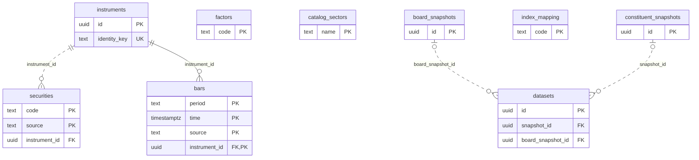
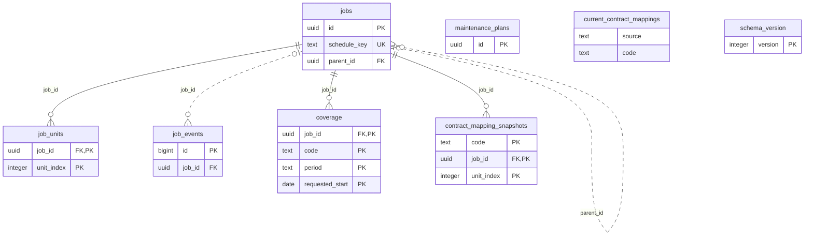
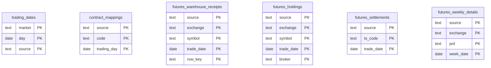
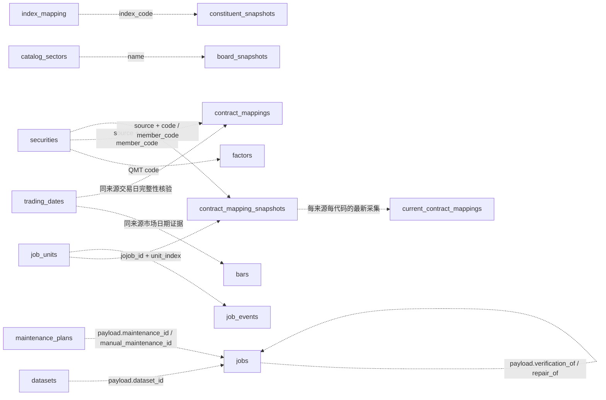

# 数据库结构、ER图与字段字典

适用迁移版本：12。覆盖 22 张表、1 个视图、229 个字段。

本文由 `tools/generate_schema_docs.py` 读取PostgreSQL系统目录生成，不读取业务行、账号Token或连接密码。SQL迁移中的COMMENT是说明来源；更改结构或口径后应更新迁移并重新生成。

```powershell
.venv\Scripts\python.exe -X utf8 -m pfor_qmt.cli migrate
.venv\Scripts\python.exe -X utf8 tools/generate_schema_docs.py
.venv\Scripts\python.exe -X utf8 tools/generate_schema_docs.py --check
```

## 阅读约定

- 物理ER图仅绘制真实外键，实体内列出主键、外键和单列唯一键；复合键按各组成字段标PK。全部字段见下方字典。
- `||`表示恰好一个，`o|`表示零或一个，`o{`表示零或多个；非标识关系使用虚线，仍是实际外键。视图没有物理主键和外键。
- JSON数组、代码匹配和任务payload引用是业务逻辑关系，不具备数据库外键约束，单独在逻辑关系图说明。
- NULL保留“未提供/未确认”，不视为零；金额、成交量与价格口径按来源及转换版本解释。
- 日历完整性、数据新鲜度和任务执行成功是不同概念；当前映射快照不能代替历史逐日映射。

## 物理ER图

### 目录、身份与行情



### 任务、维护与当前映射



### 交易日历与期货资料



## 逻辑关系（非外键）

以下仅表示代码中的引用或查询关系，不表示数据库强制约束，也不声明完整的关系基数。



成员数组、资料品种与上游原始字段继续保存在JSON或来源标识中；未额外建账号表，Token只保存在本地配置。仓单、排名、结算、周报没有到证券目录的物理外键。

## 表与字段字典

### 目录、身份与行情

#### instruments

稳定证券或合约身份；满足资料证据的普通期货月份合约可跨来源关联，资料不足时按来源与原始代码隔离。

| 字段 | PostgreSQL类型 | 可空 | 默认值 | 注释 |
| --- | --- | --- | --- | --- |
| id | uuid | 否 | gen_random_uuid() | 稳定身份UUID，供证券目录与K线外键引用。 |
| identity_key | text | 否 | 无 | 唯一身份键；有依据的月份合约为future:市场:品种:YYYYMM，否则为来源:代码；连续序列不推断跨源等价。 |

- `instruments_identity_key_key`：`UNIQUE (identity_key)`
- `instruments_pkey`：`PRIMARY KEY (id)`

<details><summary>索引定义</summary>

```sql
CREATE UNIQUE INDEX instruments_identity_key_key ON pfor_qmt.instruments USING btree (identity_key);
CREATE UNIQUE INDEX instruments_pkey ON pfor_qmt.instruments USING btree (id);
```

</details>

#### securities

统一证券目录和来源代码映射；主键为来源与原始代码，不代表该证券已有行情或接口权限。

| 字段 | PostgreSQL类型 | 可空 | 默认值 | 注释 |
| --- | --- | --- | --- | --- |
| code | text | 否 | 无 | 数据源原始证券代码，含市场后缀；保留QMT代码大小写。 |
| name | text | 否 | 无 | 来源提供的证券或合约名称；不从代码猜测名称。 |
| kind | text | 否 | 无 | 资产类别：stock股票、index指数、future期货、option期权、fund场内基金、bond债券。 |
| details | jsonb | 否 | '{}'::jsonb | 数据源原始证券详情JSON；保留来源字段及空值，不包含账号凭据。 |
| source | text | 否 | 'qmt'::text | 数据提供方：qmt或tushare；账号不是独立数据来源。 |
| updated_at | timestamp with time zone | 否 | now() | 目录记录最近保存时间，带时区；不代表行情最新时间。 |
| subtype | text | 否 | ''::text | 细分类别，如contract月份合约、continuous连续合约、combination组合、efp期转现、etf；空串表示未细分。 |
| market | text | 否 | ''::text | 统一市场代码：SH/SZ/BJ、SHO/SZO、IF/SF/DF/ZF/INE/GF；保留source区分来源。 |
| metadata | jsonb | 否 | '{}'::jsonb | 提取后的业务元数据JSON，如product、listed、expiry、delivery_month、trade_time_desc及期权属性；缺资料不猜测。 |
| instrument_id | uuid | 否 | 无 | 对应稳定身份UUID，外键指向instruments.id；一个身份可对应多个来源代码。 |

- `securities_instrument_id_fkey`：`FOREIGN KEY (instrument_id) REFERENCES instruments(id)`
- `securities_kind_check`：`CHECK ((kind = ANY (ARRAY['stock'::text, 'index'::text, 'future'::text, 'option'::text, 'fund'::text, 'bond'::text])))`
- `securities_pkey`：`PRIMARY KEY (source, code)`

<details><summary>索引定义</summary>

```sql
CREATE INDEX securities_instrument_idx ON pfor_qmt.securities USING btree (instrument_id, source);
CREATE INDEX securities_kind_market_idx ON pfor_qmt.securities USING btree (kind, market, code);
CREATE UNIQUE INDEX securities_pkey ON pfor_qmt.securities USING btree (source, code);
```

</details>

#### bars

统一不复权K线历史库；按稳定身份、来源、周期和行情时间去重更新，QMT与Tushare不相互覆盖，NULL不补零。

| 字段 | PostgreSQL类型 | 可空 | 默认值 | 注释 |
| --- | --- | --- | --- | --- |
| code | text | 否 | 无 | 采集来源的原始证券代码；查询时必须同时指定source。 |
| period | text | 否 | 无 | 周期：1d日线、1m/5m分钟；Tushare另支持15m/30m/60m、1w周线、1mo月线。 |
| time | timestamp with time zone | 否 | 无 | 带时区的行情时间或周期标签，按Asia/Shanghai解释；日线为交易日零点，分钟保留原始时刻。 |
| open | numeric | 是 | 无 | 不复权开盘价，NUMERIC精确保留合约报价单位；未提供为NULL。 |
| high | numeric | 是 | 无 | 不复权最高价，NUMERIC精确保留合约报价单位；未提供为NULL。 |
| low | numeric | 是 | 无 | 不复权最低价，NUMERIC精确保留合约报价单位；未提供为NULL。 |
| close | numeric | 是 | 无 | 不复权收盘价，NUMERIC精确保留合约报价单位；未提供为NULL。 |
| volume | numeric | 是 | 无 | 成交量；Tushare期货为手，QMT保留来源原始单位，未核验前不统一换算。 |
| amount | numeric | 是 | 无 | 成交额；Tushare日线万元精确换算为元、分钟原始为元，QMT保留原始口径；结合normalization_version解释。 |
| source | text | 否 | 'qmt'::text | 行情提供方qmt或tushare，属于复合主键；切换采集账号不重复保存同来源数据。 |
| updated_at | timestamp with time zone | 否 | now() | 该条行情最近写入或修订时间，带时区，不是行情时间。 |
| open_interest | numeric | 是 | 无 | 持仓量；Tushare期货为手，QMT保留原始单位；非适用或未提供时为NULL。 |
| settlement | numeric | 是 | 无 | 本期结算价，保留合约报价单位；未提供为NULL，不能用收盘价代填。 |
| previous_settlement | numeric | 是 | 无 | 前结算价，保留合约报价单位；未提供为NULL。 |
| trading_day | date | 是 | 无 | 终端或接口明确的交易日；期货分钟未提供时为NULL，不把夜盘自然日冒充交易日。 |
| instrument_id | uuid | 否 | 无 | 稳定证券身份UUID，外键指向instruments.id，也是K线复合主键的一部分。 |
| normalization_version | text | 否 | 'qmt-raw-v1'::text | 标准化规则版本，如qmt-raw-v1、tushare-futures-v1/v2；用于追溯数值转换和单位，不能忽略版本混用。 |
| as_of_date | date | 是 | 无 | 周/月线计算截至日期，与time周期标签分别保存；其他周期通常为NULL。 |
| source_fields | jsonb | 否 | '{}'::jsonb | 上游原始字段JSON及标准化追溯信息；未采集的原始字段不补造，空对象不表示无数值。 |

- `bars_instrument_id_fkey`：`FOREIGN KEY (instrument_id) REFERENCES instruments(id)`
- `bars_period_check`：`CHECK (((period = ANY (ARRAY['1d'::text, '1m'::text, '5m'::text])) OR ((source = 'tushare'::text) AND (period = ANY (ARRAY['1w'::text, '1mo'::text, '15m'::text, '30m'::text, '60m'::text])))))`
- `bars_pkey`：`PRIMARY KEY (instrument_id, source, period, "time")`

<details><summary>索引定义</summary>

```sql
CREATE UNIQUE INDEX bars_pkey ON pfor_qmt.bars USING btree (instrument_id, source, period, "time");
CREATE INDEX bars_source_code_time_idx ON pfor_qmt.bars USING btree (source, code, period, "time");
```

</details>

#### factors

QMT证券复权因子原始快照；当前仅按QMT代码保存，不修改bars中的不复权行情。

| 字段 | PostgreSQL类型 | 可空 | 默认值 | 注释 |
| --- | --- | --- | --- | --- |
| code | text | 否 | 无 | QMT原始证券代码，主键；当前未建立到证券目录的物理外键。 |
| raw | jsonb | 否 | 无 | QMT返回的复权因子原始JSON，不推测终端未提供的因子。 |
| observed_at | timestamp with time zone | 否 | now() | 因子快照采集时间，带时区；不等于除权除息日。 |

- `factors_pkey`：`PRIMARY KEY (code)`

<details><summary>索引定义</summary>

```sql
CREATE UNIQUE INDEX factors_pkey ON pfor_qmt.factors USING btree (code);
```

</details>

#### catalog_sectors

QMT板块目录，涵盖行业、概念及其他终端分类；板块本身不被当作可交易证券。

| 字段 | PostgreSQL类型 | 可空 | 默认值 | 注释 |
| --- | --- | --- | --- | --- |
| name | text | 否 | 无 | QMT板块名称，主键。 |
| observed_at | timestamp with time zone | 否 | now() | 板块目录最近采集时间，带时区。 |
| category | text | 否 | 'other'::text | 板块类别：industry行业、concept概念、other其他。 |
| path | jsonb | 否 | '[]'::jsonb | 终端分类树的祖先路径JSON数组，用于展示及识别类别。 |

- `catalog_sectors_pkey`：`PRIMARY KEY (name)`

<details><summary>索引定义</summary>

```sql
CREATE UNIQUE INDEX catalog_sectors_pkey ON pfor_qmt.catalog_sectors USING btree (name);
```

</details>

#### board_snapshots

行业或概念板块的当前成员快照；仅表示观察时点，不推导历史成员。

| 字段 | PostgreSQL类型 | 可空 | 默认值 | 注释 |
| --- | --- | --- | --- | --- |
| id | uuid | 否 | 无 | 板块快照UUID，供datasets.board_snapshot_id引用。 |
| name | text | 否 | 无 | QMT板块名称，与catalog_sectors.name逻辑关联。 |
| category | text | 否 | 无 | 采集时的板块类别，如industry或concept。 |
| members | jsonb | 否 | 无 | 采集时成员代码JSON数组；创建数据集时固定成员，不自动跟随板块变动。 |
| observed_at | timestamp with time zone | 否 | now() | 成员实际观察时间，带时区，不是成员调整生效日。 |

- `board_snapshots_pkey`：`PRIMARY KEY (id)`

<details><summary>索引定义</summary>

```sql
CREATE INDEX board_snapshots_latest_idx ON pfor_qmt.board_snapshots USING btree (name, observed_at DESC);
CREATE UNIQUE INDEX board_snapshots_pkey ON pfor_qmt.board_snapshots USING btree (id);
```

</details>

#### index_mapping

QMT指数代码与终端板块名称的配置映射，用于获取当前指数成员，不是历史成分或权重。

| 字段 | PostgreSQL类型 | 可空 | 默认值 | 注释 |
| --- | --- | --- | --- | --- |
| code | text | 否 | 无 | QMT指数代码，主键；与securities.code为逻辑关联。 |
| sector | text | 否 | 无 | 用于查询当前成分的QMT板块名称。 |
| name | text | 否 | 无 | 本项目保存的指数显示名称。 |
| updated_at | timestamp with time zone | 否 | now() | 指数与板块映射最近保存时间，带时区。 |

- `index_mapping_pkey`：`PRIMARY KEY (code)`

<details><summary>索引定义</summary>

```sql
CREATE UNIQUE INDEX index_mapping_pkey ON pfor_qmt.index_mapping USING btree (code);
```

</details>

#### constituent_snapshots

QMT指数当前成分采集快照；每次观察单独保存，不表示历史时点的官方成分。

| 字段 | PostgreSQL类型 | 可空 | 默认值 | 注释 |
| --- | --- | --- | --- | --- |
| id | uuid | 否 | 无 | 成分快照UUID，供datasets.snapshot_id引用。 |
| index_code | text | 否 | 无 | 对应QMT指数代码；逻辑关联index_mapping.code，没有物理外键。 |
| observed_at | timestamp with time zone | 否 | now() | 当前成分实际观察时间，带时区，不是成分调整生效日。 |
| members | jsonb | 否 | 无 | 成员QMT代码JSON数组，不含历史权重；数组成员没有逐条数据库外键。 |

- `constituent_snapshots_pkey`：`PRIMARY KEY (id)`

<details><summary>索引定义</summary>

```sql
CREATE UNIQUE INDEX constituent_snapshots_pkey ON pfor_qmt.constituent_snapshots USING btree (id);
```

</details>

#### datasets

固定采集范围的数据集配置；成员和周期为快照，修改不改变已排队任务，软删除后保留历史引用。

| 字段 | PostgreSQL类型 | 可空 | 默认值 | 注释 |
| --- | --- | --- | --- | --- |
| id | uuid | 否 | 无 | 数据集UUID；任务payload.dataset_id为逻辑引用，不是物理外键。 |
| name | text | 否 | 无 | 用户定义的数据集名称。 |
| members | jsonb | 否 | 无 | 固定成员代码JSON数组，代码属于source；不会自动跟随指数或板块最新成分。 |
| periods | jsonb | 否 | 无 | 选择的K线周期JSON数组；来源能力和具体月份合约限制由业务层校验。 |
| index_code | text | 是 | 无 | 指数型数据集来源的QMT指数代码；手工数据集为空。 |
| snapshot_id | uuid | 是 | 无 | 创建或显式刷新时采用的指数成分快照UUID，可空，外键指向constituent_snapshots.id。 |
| scheduled | boolean | 否 | false | 是否启用数据集自动更新；回收站记录必须为false。 |
| schedule_from | date | 否 | CURRENT_DATE | 自动更新的起始日期；用于避免启用后无边界补执行。 |
| created_at | timestamp with time zone | 否 | now() | 数据集创建时间，带时区。 |
| board_name | text | 是 | 无 | 板块型数据集来源的行业或概念板块名称，手工数据集为空。 |
| board_snapshot_id | uuid | 是 | 无 | 采用的板块成员快照UUID，可空，外键指向board_snapshots.id。 |
| source | text | 否 | 'qmt'::text | 固定来源qmt或tushare；编辑时不能直接切换来源。 |
| account_id | text | 是 | 无 | Tushare配置中的稳定账号ID引用，非Token；QMT无需账号绑定，可为NULL。 |
| endpoint | text | 是 | 无 | 任务采集绑定的Tushare API端点，非凭据；改默认账号不会隐式重绑。 |
| schedule_time | time without time zone | 否 | '17:00:00'::time without time zone | Asia/Shanghai自动更新时间，不带时区类型；SQL默认17:00，Tushare新配置由应用默认19:00。 |
| revision | integer | 否 | 1 | 配置乐观锁版本；有效配置变更由触发器递增，拒绝过期编辑覆盖。 |
| deleted_at | timestamp with time zone | 是 | 无 | 进入可恢复回收站的时间，NULL表示未删除；不会物理删除行情。 |

- `datasets_board_snapshot_id_fkey`：`FOREIGN KEY (board_snapshot_id) REFERENCES board_snapshots(id)`
- `datasets_pkey`：`PRIMARY KEY (id)`
- `datasets_snapshot_id_fkey`：`FOREIGN KEY (snapshot_id) REFERENCES constituent_snapshots(id)`
- `datasets_source_check`：`CHECK ((source = ANY (ARRAY['qmt'::text, 'tushare'::text])))`
- `deleted_dataset_disabled`：`CHECK (((deleted_at IS NULL) OR (NOT scheduled)))`

<details><summary>索引定义</summary>

```sql
CREATE UNIQUE INDEX datasets_pkey ON pfor_qmt.datasets USING btree (id);
```

</details>

### 任务、维护与当前映射

#### jobs

统一目录、采集、导出及只读核验任务；执行状态与分块质量分离，重试创建关联新任务保留证据。

| 字段 | PostgreSQL类型 | 可空 | 默认值 | 注释 |
| --- | --- | --- | --- | --- |
| id | uuid | 否 | 无 | 任务UUID，供分块、事件、覆盖及当前映射快照引用。 |
| kind | text | 否 | 无 | 任务类型：catalog目录同步、download资料或行情采集、export文件导出、verify只读核验。 |
| state | text | 否 | 'queued'::text | 执行状态：queued、running、retrying、succeeded、partial、failed、blocked、cancelled；succeeded不等于所有历史数据完整。 |
| payload | jsonb | 否 | 无 | 固定请求JSON，含source、成员/周期或资料selections、日期、chunks和账号端点引用；dataset_id、maintenance_id、verification_of等为逻辑引用，不保存Token。 |
| checkpoint | integer | 否 | 0 | 持久化处理游标；采集/核验通常为下一分块索引，目录为处理位置，导出为已写行数；不能直接当成功分块数。 |
| attempts | integer | 否 | 0 | 当前网络重试计数，成功处理后可重置；不是关联任务重试总次数。 |
| cancel_requested | boolean | 否 | false | 用户请求取消后续处理的标记；不撤销已发出的终端请求或已提交数据。 |
| result | jsonb | 否 | '{}'::jsonb | 任务结果JSON，如rows、coverage、quality_summary、message或导出文件名；需结合state与质量解释。 |
| error | text | 是 | 无 | 最近任务错误的脱敏说明，可空；历史错误不因关联重试自动改写。 |
| schedule_key | text | 是 | 无 | 可空的调度去重键，唯一约束防止同维护范围同截止日期重复入队。 |
| created_at | timestamp with time zone | 否 | now() | 任务创建时间，带时区；列表按此统计不代表行情业务日期。 |
| updated_at | timestamp with time zone | 否 | now() | 任务最近状态或进度更新时间，带时区。 |
| parent_id | uuid | 是 | 无 | 关联重试的直接父任务UUID，可空，自引用外键指向jobs.id。 |
| error_code | text | 是 | 无 | 稳定错误分类码，如数据库、权限、连接、能力或数据校验错误；无错误时NULL。 |
| action | text | 是 | 无 | 最近错误对应的可执行建议，脱敏文本，可空。 |
| run_number | integer | 否 | 0 | 此任务实例的执行轮次，每次开始执行递增；与重试子任务ID分开。 |
| deleted_at | timestamp with time zone | 是 | 无 | 任务进入可恢复回收站的时间，活动任务不允许回收；行情、文件和质量证据不随之删除。 |

- `deleted_job_inactive`：`CHECK (((deleted_at IS NULL) OR (state <> ALL (ARRAY['queued'::text, 'running'::text, 'retrying'::text]))))`
- `jobs_kind_check`：`CHECK ((kind = ANY (ARRAY['catalog'::text, 'download'::text, 'export'::text, 'verify'::text])))`
- `jobs_parent_id_fkey`：`FOREIGN KEY (parent_id) REFERENCES jobs(id)`
- `jobs_pkey`：`PRIMARY KEY (id)`
- `jobs_schedule_key_key`：`UNIQUE (schedule_key)`

<details><summary>索引定义</summary>

```sql
CREATE INDEX jobs_console_source_created ON pfor_qmt.jobs USING btree (COALESCE((payload ->> 'source'::text), 'qmt'::text), created_at DESC, id);
CREATE INDEX jobs_parent_idx ON pfor_qmt.jobs USING btree (parent_id);
CREATE UNIQUE INDEX jobs_pkey ON pfor_qmt.jobs USING btree (id);
CREATE INDEX jobs_provider_queue_idx ON pfor_qmt.jobs USING btree (kind, state, COALESCE((payload ->> 'source'::text), 'qmt'::text), created_at);
CREATE INDEX jobs_queue_idx ON pfor_qmt.jobs USING btree (kind, state, created_at);
CREATE UNIQUE INDEX jobs_schedule_key_key ON pfor_qmt.jobs USING btree (schedule_key);
```

</details>

#### job_units

任务分块最新执行与质量结果，用于恢复、定向重试和核验；任务总体状态由各分块汇总。

| 字段 | PostgreSQL类型 | 可空 | 默认值 | 注释 |
| --- | --- | --- | --- | --- |
| job_id | uuid | 否 | 无 | 所属任务UUID，外键指向jobs.id。 |
| unit_index | integer | 否 | 无 | payload.chunks中的从0开始的序号，与job_id组成主键。 |
| request | jsonb | 否 | 无 | 该分块固定请求JSON，包含对象、周期或资料、日期及选择范围。 |
| state | text | 否 | 无 | 分块执行状态；可为succeeded但quality_state仍待核验，不与质量混为一类。 |
| quality_state | text | 否 | 无 | 质量状态：verified、pending_verification、not_published、not_applicable、missing、rejected、stale。 |
| row_count | integer | 否 | 0 | 该分块实际保存或只读核验的记录数，0不等于成功取得资料。 |
| issues | jsonb | 否 | '[]'::jsonb | 结构化问题JSON数组，含code、quality_state、reason、action、retryable及可选日期/样本信息。 |
| error_code | text | 是 | 无 | 分块执行失败或受阻的稳定错误码；普通质量待核验可为NULL。 |
| retryable | boolean | 否 | false | 是否允许按既有重试规则再尝试；权限和能力不足不自动重试。 |
| stats | jsonb | 否 | '{}'::jsonb | 读写统计JSON，如read、inserted、updated、unchanged_or_older；没有统计时为空对象。 |
| updated_at | timestamp with time zone | 否 | now() | 该分块结果最近记录时间，带时区。 |

- `job_units_job_id_fkey`：`FOREIGN KEY (job_id) REFERENCES jobs(id)`
- `job_units_pkey`：`PRIMARY KEY (job_id, unit_index)`

<details><summary>索引定义</summary>

```sql
CREATE UNIQUE INDEX job_units_pkey ON pfor_qmt.job_units USING btree (job_id, unit_index);
```

</details>

#### job_events

脱敏任务事件与部分系统运维事件流水；事件保留期与异常样本保留期分别管理，不替代行情库。

| 字段 | PostgreSQL类型 | 可空 | 默认值 | 注释 |
| --- | --- | --- | --- | --- |
| id | bigint | 否 | nextval('job_events_id_seq'::regclass) | 自增事件编号，用于稳定排序和游标分页。 |
| job_id | uuid | 是 | 无 | 关联任务UUID，可空，外键指向jobs.id；无任务的调度/配置事件为NULL。 |
| run_number | integer | 否 | 0 | 事件所属任务执行轮次；无任务或旧事件可为0。 |
| unit_index | integer | 是 | 无 | 关联分块的0起始序号，可空；不是到job_units的物理外键。 |
| level | text | 否 | 无 | 日志等级，例如info、warning、error。 |
| code | text | 否 | 无 | 结构化事件码，如JOB_STARTED、UNIT_STARTED、NETWORK_RETRY或错误码。 |
| message | text | 否 | 无 | 面向使用者的脱敏事件说明，不含连接密码或Token。 |
| context | jsonb | 否 | '{}'::jsonb | 脱敏请求摘要、范围、来源、状态或统计JSON，不保存完整凭据。 |
| sample | jsonb | 是 | 无 | 可空的脱敏异常样本JSON；保留期通常短于事件本身。 |
| created_at | timestamp with time zone | 否 | now() | 事件记录时间，带时区，用于日志时间筛选。 |

- `job_events_job_id_fkey`：`FOREIGN KEY (job_id) REFERENCES jobs(id)`
- `job_events_pkey`：`PRIMARY KEY (id)`

<details><summary>索引定义</summary>

```sql
CREATE INDEX job_events_job_idx ON pfor_qmt.job_events USING btree (job_id, id);
CREATE UNIQUE INDEX job_events_pkey ON pfor_qmt.job_events USING btree (id);
CREATE INDEX job_events_time_idx ON pfor_qmt.job_events USING btree (created_at);
```

</details>

#### coverage

任务各对象周期请求区间与实际读写范围、行数及缺口证据；覆盖记录不自动证明连续性。

| 字段 | PostgreSQL类型 | 可空 | 默认值 | 注释 |
| --- | --- | --- | --- | --- |
| job_id | uuid | 否 | 无 | 所属任务UUID，外键指向jobs.id。 |
| code | text | 否 | 无 | 采集对象代码；行情为原始证券代码，资料可为交易所与品种组成的对象标识。 |
| period | text | 否 | 无 | 行情周期或资料资源名，如1d、1m、calendar、mapping。 |
| requested_start | date | 否 | 无 | 该分块请求的包含边界开始日期；属于复合主键。 |
| requested_end | date | 否 | 无 | 该分块请求的包含边界结束日期。 |
| actual_start | timestamp with time zone | 是 | 无 | 该分块实际记录的最早时间，可空；当前映射为采集时间，不是历史映射交易日。 |
| actual_end | timestamp with time zone | 是 | 无 | 该分块实际记录的最晚时间，可空。 |
| row_count | integer | 否 | 无 | 分块实际读取并提交或核验的记录数；重复回补可包含已存在行，不等于新增行数。 |
| gaps | jsonb | 否 | '[]'::jsonb | 缺口及质量问题JSON数组，含原因、质量状态、建议和证据；空数组不证明未检查的范围完整。 |

- `coverage_job_id_fkey`：`FOREIGN KEY (job_id) REFERENCES jobs(id)`
- `coverage_pkey`：`PRIMARY KEY (job_id, code, period, requested_start)`

<details><summary>索引定义</summary>

```sql
CREATE UNIQUE INDEX coverage_pkey ON pfor_qmt.coverage USING btree (job_id, code, period, requested_start);
```

</details>

#### maintenance_plans

用户明确保存的目录或资料自动维护范围；复用jobs队列，保存不等于执行，现有排队任务保持原范围。

| 字段 | PostgreSQL类型 | 可空 | 默认值 | 注释 |
| --- | --- | --- | --- | --- |
| id | uuid | 否 | 无 | 维护计划UUID；jobs.payload中的maintenance_id等为逻辑引用。 |
| name | text | 否 | 无 | 用户定义的维护计划名称。 |
| source | text | 否 | 无 | 固定数据源qmt或tushare，来源之间独立调度。 |
| kind | text | 否 | 无 | 维护任务类型catalog或download，不直接维护export或verify。 |
| payload | jsonb | 否 | 无 | 固定维护范围JSON，包含资源/成员/周期及来源账号端点引用；不含Token，执行时生成日期和分块。 |
| enabled | boolean | 否 | true | 是否启用自动维护；数据库兼容默认true，当前控制台新建默认false，回收记录必须停用。 |
| schedule_time | time without time zone | 否 | 无 | Asia/Shanghai语义的每日触发时间；QMT新配置默认17:00，Tushare默认19:00，由应用设置。 |
| lookback_days | integer | 否 | 5 | 回读窗口长度，1至365；通常为交易日数，QMT日历自然日维护使用自然日窗口，当前映射仅采执行时快照。 |
| last_date | date | 是 | 无 | 已入队维护的最近截止日期，不代表该日期数据已成功或完整入库。 |
| last_error | text | 是 | 无 | 最近调度问题说明，可空；应结合关联任务和分块质量检查。 |
| updated_at | timestamp with time zone | 否 | now() | 维护配置或调度记录最近更新时间，带时区。 |
| revision | integer | 否 | 1 | 配置乐观锁版本；配置变更递增，last_date/last_error等运行游标变更不递增。 |
| deleted_at | timestamp with time zone | 是 | 无 | 进入可恢复回收站的时间，NULL表示未回收；恢复后仍停用。 |

- `deleted_plan_disabled`：`CHECK (((deleted_at IS NULL) OR (NOT enabled)))`
- `maintenance_plans_kind_check`：`CHECK ((kind = ANY (ARRAY['catalog'::text, 'download'::text])))`
- `maintenance_plans_lookback_days_check`：`CHECK (((lookback_days >= 1) AND (lookback_days <= 365)))`
- `maintenance_plans_pkey`：`PRIMARY KEY (id)`

<details><summary>索引定义</summary>

```sql
CREATE UNIQUE INDEX maintenance_plans_pkey ON pfor_qmt.maintenance_plans USING btree (id);
```

</details>

#### contract_mapping_snapshots

当前主力或连续映射的观察快照，与历史逐日映射分开；按任务、分块和连续代码幂等保存。

| 字段 | PostgreSQL类型 | 可空 | 默认值 | 注释 |
| --- | --- | --- | --- | --- |
| source | text | 否 | 无 | 当前映射提供方，目前采集链路为qmt；预留来源维度，不与Tushare历史映射混用。 |
| code | text | 否 | 无 | 请求的原始主力或连续代码；和job_id、unit_index组成幂等主键。 |
| member_code | text | 否 | 无 | 终端明确返回的月份代码；无后缀时按请求市场补齐，原始值保存在source_fields。 |
| observed_at | timestamp with time zone | 否 | 无 | 实际采集时间，带时区；不用于冒充历史映射交易日。 |
| trading_day | date | 是 | 无 | 终端明确给出的交易日，可晚于采集自然日；未提供时为NULL。 |
| job_id | uuid | 否 | 无 | 生成快照的采集任务UUID，外键指向jobs.id，核验原任务时读取原快照。 |
| unit_index | integer | 否 | 无 | 采集任务内从0开始的分块序号；与job_units为逻辑关联，无复合外键。 |
| source_fields | jsonb | 否 | 无 | 原始返回、方法、TradingDay及需要时双方ProductID证据JSON。 |

- `contract_mapping_snapshots_job_id_fkey`：`FOREIGN KEY (job_id) REFERENCES jobs(id)`
- `contract_mapping_snapshots_pkey`：`PRIMARY KEY (job_id, unit_index, code)`

<details><summary>索引定义</summary>

```sql
CREATE UNIQUE INDEX contract_mapping_snapshots_pkey ON pfor_qmt.contract_mapping_snapshots USING btree (job_id, unit_index, code);
CREATE INDEX mapping_snapshots_latest_idx ON pfor_qmt.contract_mapping_snapshots USING btree (source, code, observed_at DESC);
```

</details>

#### current_contract_mappings（视图）

每个来源和连续代码的最新已保存映射视图；按observed_at、job_id倒序选一条，不是终端实时查询。

| 字段 | PostgreSQL类型 | 可空 | 默认值 | 注释 |
| --- | --- | --- | --- | --- |
| source | text | 视图派生 | 无 | 最新快照的数据提供方，与code共同构成视图的逻辑唯一维度。 |
| code | text | 视图派生 | 无 | 原始主力或连续合约代码；视图本身没有主键或外键约束。 |
| member_code | text | 视图派生 | 无 | 最新快照对应的具体月份合约代码。 |
| observed_at | timestamp with time zone | 视图派生 | 无 | 最新快照实际采集时间，带时区。 |
| trading_day | date | 视图派生 | 无 | 最新快照中终端明确给出的交易日，缺失为NULL。 |
| job_id | uuid | 视图派生 | 无 | 原始采集任务UUID，来自快照表；视图不另建任务。 |
| unit_index | integer | 视图派生 | 无 | 原始采集任务内从0开始的分块序号。 |
| source_fields | jsonb | 视图派生 | 无 | 最新快照的原始返回与品种校验证据JSON。 |
| row_version | xid | 视图派生 | 无 | 源快照行的PostgreSQL xmin事务标识，用于查询快照一致性校验；不是业务时间或永久递增版本。 |

```sql
 SELECT DISTINCT ON (source, code) source,
    code,
    member_code,
    observed_at,
    trading_day,
    job_id,
    unit_index,
    source_fields,
    xmin AS row_version
   FROM contract_mapping_snapshots
  ORDER BY source, code, observed_at DESC, job_id DESC;
```

#### schema_version

数据库迁移版本记录；由迁移器在同一事务中登记，非应用发布版本。

| 字段 | PostgreSQL类型 | 可空 | 默认值 | 注释 |
| --- | --- | --- | --- | --- |
| version | integer | 否 | 无 | 已完成的版本化SQL迁移编号，主键。 |
| applied_at | timestamp with time zone | 否 | now() | 该迁移首次登记时间，带时区。 |

- `schema_version_pkey`：`PRIMARY KEY (version)`

<details><summary>索引定义</summary>

```sql
CREATE UNIQUE INDEX schema_version_pkey ON pfor_qmt.schema_version USING btree (version);
```

</details>

### 交易日历与期货资料

#### trading_dates

按来源和市场保存日历证据；完整交易所日历与K线观察日期分别标记，缺记录为未知，不默认休市。

| 字段 | PostgreSQL类型 | 可空 | 默认值 | 注释 |
| --- | --- | --- | --- | --- |
| market | text | 否 | 无 | 统一市场代码；与source、day共同组成主键，不借用其他市场日历。 |
| day | date | 否 | 无 | Asia/Shanghai语义下的日历日期。 |
| source | text | 否 | 'qmt'::text | 日期证据提供方qmt或tushare；不同来源不自动合并。 |
| is_open | boolean | 否 | true | true为开市、false为休市；是否能作完整日历证据须同时检查evidence，缺记录不是false。 |
| pretrade_date | date | 是 | 无 | 上游明确给出的上一交易日；未提供时为NULL，不自行按自然日回退。 |
| evidence | text | 否 | 'legacy'::text | 证据类别：calendar独立日历、calendar_open未来已返回开市日、bar_observation日K线观察、legacy旧记录依据未核验。 |
| observed_at | timestamp with time zone | 是 | 无 | 该日期证据采集时间，带时区；旧数据未记录时为NULL。 |
| source_fields | jsonb | 是 | 无 | 原始日历依据JSON，含方法、请求范围或样本合约和日期；旧记录可为NULL。 |

- `trading_dates_pkey`：`PRIMARY KEY (source, market, day)`

<details><summary>索引定义</summary>

```sql
CREATE UNIQUE INDEX trading_dates_pkey ON pfor_qmt.trading_dates USING btree (source, market, day);
```

</details>

#### contract_mappings

来源提供的历史逐日主力或连续序列到月份合约映射；不由当前快照倒填，不拼接连续分钟。

| 字段 | PostgreSQL类型 | 可空 | 默认值 | 注释 |
| --- | --- | --- | --- | --- |
| source | text | 否 | 无 | 映射提供方qmt或tushare；不同来源连续序列的编制规则不假定相同。 |
| code | text | 否 | 无 | 来源原始主力或连续序列代码，保留市场后缀及大小写。 |
| trading_day | date | 否 | 无 | 上游明确给出的映射交易日；与source、code组成主键。 |
| member_code | text | 否 | 无 | 该交易日对应的具体月份合约原始代码，不是证券名称。 |
| updated_at | timestamp with time zone | 否 | now() | 历史映射最近写入时间，带时区，不表示关系生效时间。 |
| source_fields | jsonb | 是 | 无 | 历史映射原始记录及必要品种校验证据JSON；未记录时为NULL。 |

- `contract_mappings_pkey`：`PRIMARY KEY (source, code, trading_day)`

<details><summary>索引定义</summary>

```sql
CREATE UNIQUE INDEX contract_mappings_pkey ON pfor_qmt.contract_mappings USING btree (source, code, trading_day);
```

</details>

#### futures_warehouse_receipts

Tushare仓单日报明细；按仓库、等级、年度等维度保留原始单位，汇总行与明细不重复合计。

| 字段 | PostgreSQL类型 | 可空 | 默认值 | 注释 |
| --- | --- | --- | --- | --- |
| source | text | 否 | 无 | 资料提供方，当前为tushare。 |
| exchange | text | 否 | 无 | 上游期货交易所代码，如SHFE、DCE、CZCE。 |
| symbol | text | 否 | 无 | 上游期货品种代码；与exchange共同限定品种。 |
| trade_date | date | 否 | 无 | 仓单日报交易日期。 |
| row_key | text | 否 | 无 | 仓库/产品/地区/年度/等级/品牌/产地/折算/单位等维度生成的SHA-256键，防止不同明细覆盖。 |
| fut_name | text | 是 | 无 | 上游期货产品名称，未提供为NULL。 |
| warehouse | text | 是 | 无 | 仓库或厂库名称，保留上游原值，不据名称推断汇总层级。 |
| wh_id | text | 是 | 无 | 上游仓库编号，未提供为NULL。 |
| pre_vol | numeric | 是 | 无 | 前日仓单数量，按本行unit解释，未提供为NULL。 |
| vol | numeric | 是 | 无 | 当日仓单数量，按本行unit解释，不跨单位合计。 |
| vol_chg | numeric | 是 | 无 | 仓单数量变化，按本行unit解释，可为负或NULL。 |
| area | text | 是 | 无 | 上游地区信息，未提供为NULL。 |
| year | text | 是 | 无 | 上游年度标记，按原始文本保存，不强制推断生产年或交割年。 |
| grade | text | 是 | 无 | 上游等级信息，未提供为NULL。 |
| brand | text | 是 | 无 | 上游品牌信息，未提供为NULL。 |
| place | text | 是 | 无 | 上游产地信息，未提供为NULL。 |
| pd | numeric | 是 | 无 | 上游升贴水数值，原口径保留；未提供为NULL，不猜测单位。 |
| is_ct | text | 是 | 无 | 上游折算仓单标记，保留原始文本；不是自动识别汇总行的依据。 |
| unit | text | 是 | 无 | 本行仓单数量原始单位；不同单位不可直接相加。 |
| updated_at | timestamp with time zone | 否 | now() | 该仓单记录最近入库时间，带时区。 |

- `futures_warehouse_receipts_pkey`：`PRIMARY KEY (source, exchange, symbol, trade_date, row_key)`

<details><summary>索引定义</summary>

```sql
CREATE UNIQUE INDEX futures_warehouse_receipts_pkey ON pfor_qmt.futures_warehouse_receipts USING btree (source, exchange, symbol, trade_date, row_key);
```

</details>

#### futures_holdings

Tushare每日成交持仓会员记录；仅为返回范围，NULL表示该项未提供或未上榜，不代表0或完整市场排名。

| 字段 | PostgreSQL类型 | 可空 | 默认值 | 注释 |
| --- | --- | --- | --- | --- |
| source | text | 否 | 无 | 资料提供方，当前为tushare。 |
| exchange | text | 否 | 无 | 上游交易所代码；INE持仓按官方SHFE入口读取并保留返回交易所。 |
| symbol | text | 否 | 无 | 上游品种或月份合约标识，不一定带交易所后缀。 |
| trade_date | date | 否 | 无 | 资料交易日期，按Asia/Shanghai解释。 |
| broker | text | 否 | 无 | 期货公司或会员名称，是逐日记录维度，不是用户交易账号。 |
| vol | numeric | 是 | 无 | 该会员成交量，单位手；未提供为NULL。 |
| vol_chg | numeric | 是 | 无 | 成交量较前日变化，单位手，可为负或NULL。 |
| long_hld | numeric | 是 | 无 | 持买仓量，单位手；未上榜或未提供为NULL。 |
| long_chg | numeric | 是 | 无 | 持买仓量变化，单位手，可为负或NULL。 |
| short_hld | numeric | 是 | 无 | 持卖仓量，单位手；未上榜或未提供为NULL。 |
| short_chg | numeric | 是 | 无 | 持卖仓量变化，单位手，可为负或NULL。 |
| updated_at | timestamp with time zone | 否 | now() | 该资料最近入库时间，带时区。 |

- `futures_holdings_pkey`：`PRIMARY KEY (source, exchange, symbol, trade_date, broker)`

<details><summary>索引定义</summary>

```sql
CREATE UNIQUE INDEX futures_holdings_pkey ON pfor_qmt.futures_holdings USING btree (source, exchange, symbol, trade_date, broker);
```

</details>

#### futures_settlements

Tushare每日结算参数；费率/费用保留上游原值，不等于用户券商账户实际收费或保证金。

| 字段 | PostgreSQL类型 | 可空 | 默认值 | 注释 |
| --- | --- | --- | --- | --- |
| source | text | 否 | 无 | 资料提供方，当前为tushare。 |
| ts_code | text | 否 | 无 | Tushare具体月份合约代码，含原始交易所后缀。 |
| exchange | text | 否 | 无 | Tushare交易所代码，需与ts_code市场一致。 |
| trade_date | date | 否 | 无 | 结算参数适用交易日期，不是采集时间。 |
| settle | numeric | 是 | 无 | 结算价，保留合约报价单位，未提供为NULL。 |
| trading_fee_rate | numeric | 是 | 无 | 交易手续费率原值；比例基准按上游说明，未自动乘100。 |
| trading_fee | numeric | 是 | 无 | 交易手续费原值；按上游费用口径，不自动解释为账户费率。 |
| delivery_fee | numeric | 是 | 无 | 交割费用原值；单位与计费基准按上游资料。 |
| b_hedging_margin_rate | numeric | 是 | 无 | 买套保保证金率原值，不自动换算百分比。 |
| s_hedging_margin_rate | numeric | 是 | 无 | 卖套保保证金率原值，不自动换算百分比。 |
| long_margin_rate | numeric | 是 | 无 | 买投机保证金率原值，不代表账户实际保证金。 |
| short_margin_rate | numeric | 是 | 无 | 卖投机保证金率原值，不代表账户实际保证金。 |
| offset_today_fee | numeric | 是 | 无 | 平今仓手续费或费率原值，保留上游口径，未提供为NULL。 |
| updated_at | timestamp with time zone | 否 | now() | 该结算资料最近入库时间，带时区。 |

- `futures_settlements_pkey`：`PRIMARY KEY (source, ts_code, trade_date)`

<details><summary>索引定义</summary>

```sql
CREATE UNIQUE INDEX futures_settlements_pkey ON pfor_qmt.futures_settlements USING btree (source, ts_code, trade_date);
```

</details>

#### futures_weekly_details

Tushare提供的主要品种交易周报，来源中国证监会；按上游周日期保存，不按日线规则推断缺口。

| 字段 | PostgreSQL类型 | 可空 | 默认值 | 注释 |
| --- | --- | --- | --- | --- |
| source | text | 否 | 无 | 采集提供方，当前为tushare；统计资料原始来源为中国证监会。 |
| exchange | text | 否 | 无 | 上游期货交易所代码。 |
| prd | text | 否 | 无 | 上游主要品种代码，不是具体月份合约代码。 |
| week_date | date | 否 | 无 | 上游提供的周日期，参与主键；不从week强制按ISO周换算。 |
| week | text | 否 | 无 | 上游原始周编号文本，保留20199等未补零形式，不假定ISO周。 |
| name | text | 是 | 无 | 上游品种名称，未提供为NULL。 |
| vol | numeric | 是 | 无 | 本周成交量，单位手；不是累计量。 |
| vol_yoy | numeric | 是 | 无 | 本周成交量同比，上游原始百分数，可负或NULL。 |
| amount | numeric | 是 | 无 | 本周成交金额，原始亿元精确换算为元；原值见original_amount。 |
| amout_yoy | numeric | 是 | 无 | 本周成交金额同比，上游原始百分数；保留上游amout拼写以兼容接口。 |
| cumvol | numeric | 是 | 无 | 年累计成交量，单位手；不能跨周相加形成总量。 |
| cumvol_yoy | numeric | 是 | 无 | 年累计成交量同比，上游原始百分数。 |
| cumamt | numeric | 是 | 无 | 年累计成交金额，由亿元精确换算为元；不能跨周累计求和。 |
| cumamt_yoy | numeric | 是 | 无 | 年累计成交金额同比，上游原始百分数。 |
| open_interest | numeric | 是 | 无 | 本周持仓量，单位手，属于时点量，不跨周累计。 |
| interest_wow | numeric | 是 | 无 | 持仓量环比，上游原始百分数。 |
| mc_close | numeric | 是 | 无 | 主力合约收盘价，保留品种报价单位；不是自行拼接价格。 |
| close_wow | numeric | 是 | 无 | 主力收盘价环比，上游原始百分数。 |
| original_amount | numeric | 是 | 无 | 上游本周成交金额原值，单位亿元，精确保留用于校验换算。 |
| original_cumamt | numeric | 是 | 无 | 上游年累计成交金额原值，单位亿元。 |
| normalization_version | text | 否 | 无 | 周报换算规则版本，目前为tushare-weekly-detail-v1。 |
| updated_at | timestamp with time zone | 否 | now() | 该周报记录最近入库时间，带时区，不等于周日期。 |

- `futures_weekly_details_pkey`：`PRIMARY KEY (source, exchange, prd, week_date)`

<details><summary>索引定义</summary>

```sql
CREATE UNIQUE INDEX futures_weekly_details_pkey ON pfor_qmt.futures_weekly_details USING btree (source, exchange, prd, week_date);
```

</details>
